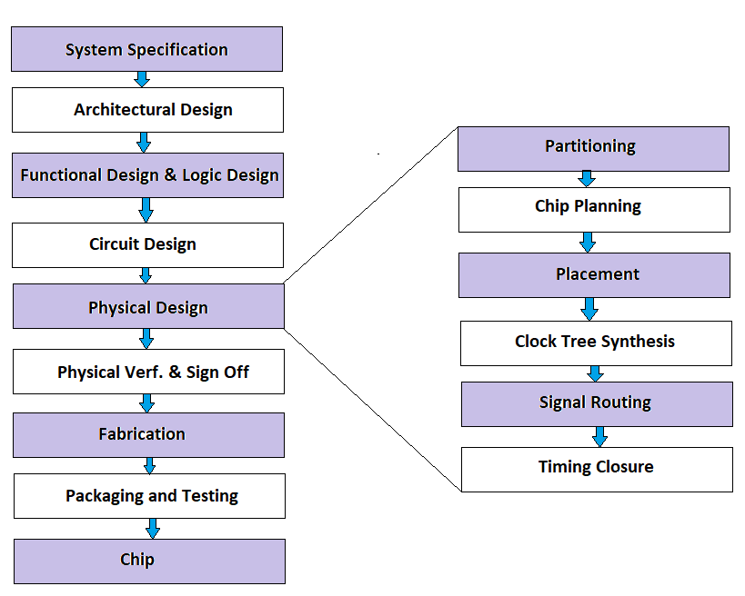

# 📌 Day 1: Introduction to VLSI & Design Flow

## ✅ Topics Covered
- What is **VLSI** and why is it important?
- Applications of **VLSI in real-world devices**.
- Understanding the **VLSI Design Flow**.
- Documenting my progress using **GitHub**.

---

## 📖 What is VLSI?
**VLSI (Very Large-Scale Integration)** is a method of designing integrated circuits by combining **millions of transistors** into a single chip. It powers devices like **smartphones, laptops, and embedded systems**.

### 💡 Real-World Applications
- **Processors (Intel, AMD, Apple M1)**
- **IoT Devices (Low-power chips)**
- **Space Tech (Radar & Navigation Systems)**

---

## 📜 VLSI Design Flow
Design flow, also known as the design methodology, is a systematic approach used in VLSI design to ensure the efficient and effective development of integrated circuits. It provides a structured framework that helps designers navigate through different stages of the design process, from concept to production. The design flow encompasses several steps, including specification, design entry, synthesis, verification, layout, and fabrication.

One of the primary objectives of the design flow is to minimize the design cycle time while maximizing the quality and reliability of the final product. It allows designers to break down the complex VLSI design process into smaller, manageable tasks, enabling them to focus on specific aspects of the design at each stage. By following a well-defined design flow, engineers can streamline the design process, reduce errors, and enhance the overall productivity of the VLSI design team.

This is the **step-by-step process** of designing a chip.

### 🔑 Key Steps
1. **Specification** → Define chip functionality.
2. **RTL Design (Verilog)** → Write hardware description.
3. **Functional Verification** → Simulate & debug code.
4. **Synthesis** → Convert Verilog into logic gates.
5. **Floorplanning & Placement** → Arrange logic blocks.
6. **Routing** → Connect components with metal layers.
7. **Fabrication** → Manufacturing the chip.
8. **Testing** → Validate the final design.

---

## 🛠 Tools Used Today
- **Vivado** → For Verilog simulations
- **Draw.io** → To create the design flowchart

---

## 📂 Files in This Folder
| File | Description |
|------|------------|
| `README.md` | Documentation for Day 1 |
| `VLSI_Flowchart.png` | Flowchart of VLSI Design Flow |

---

## 🔥 Key Takeaways
- **VLSI is everywhere** – from processors to IoT devices.
- The **VLSI design flow is step-by-step** – from **Verilog to Physical Layout**.
- **Good documentation is important** – Using GitHub helps track progress.

---

## References
- https://www.maven-silicon.com/blog/what-is-design-flow-in-vlsi/

---

## 📢 What's Next?
📅 **Day 2:** Writing my first **Verilog program (AND, OR, XOR Gates)**! 🚀
